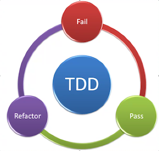

# Concepts

## Links

[Object-Oriented Programming (OOP)](#object-oriented-programming-oop)
[Test Driven Development (TDD)](#test-driven-development)

## Object-Oriented Programming (OOP)

  - Four pillars for OOP
  - **APIE**
    - **Abstraction**
    - **Polymorphism**
    - **Inheritance**
    - **Encapsulation**
  - Based on the concepts of objects
    - Can contain **data** in the form of **attributes** or **properties**
    - Can contain **actions** in the form of **functions** or **methods**

- ### **Abstraction**

  - Abstraction is getting rid of unnecessary information for the user. We should only care about calling the method and the not underlying implementation.
  
- ### **Polymorphism**

  - Polymorphism is 

- ### **Inheritance**

  - Inheritance is 

- ### **Encapsulation**
  
  - Fundamental concept in OOP. It is the idea of bundling data and methods that work on that data within one unit. This is usually used to hide internal representaion, or state of an object from the outside. This is called information hiding.

## Test Driven Development

- Philosophies for TTD
  - Write the smallest possible test case that matches what we need to program.
  - Run the test and watch it fail. This gets you into thinking how to write only the code that makes it pass.
  - Write some code with the goal of making the test pas
  - Run your test suite. Repeat steps 3 and 4 until all tests pass.
  - Go back and refactor your new code, making it as simple and clear as possible while keeping the test suite green.

