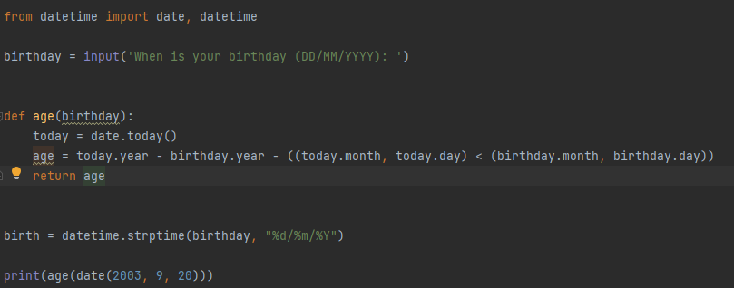
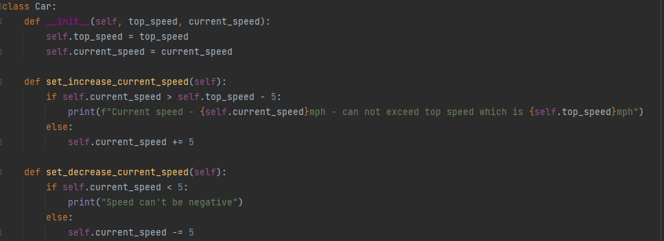
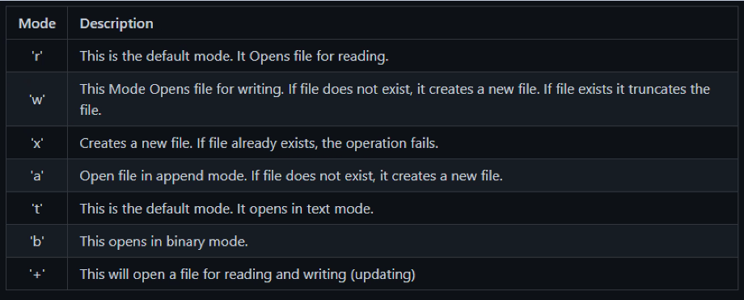

# Python

## Types of Variables

- String
- Int
- Float
- Complex -> Not really used
- Boolean -> Truthy and Falsey values. Falsey: 0, None, null, '', [ ], { }. Truthy values have a value in or is greater than 0.
- Dictionaries -> Like Objects in JS
- Lists -> Like an Array in JS
- Tuple -> Similar to lists but immutable
- Sets -> Is unordered, unchangeable and unindexed. Duplicates not allowed

## Methods

- .trim() -> Gets rid of white space
- .lower() -> Lowers any capital letters within the string
- .upper() -> Capitalizes any lowercase letters within the string

## Control Flow

`if`, `elif` and `else` statements

## Loops

Loops allow you to go through lists, tuples, dictionaries etc.

```
for something in list:
  print(this)
```

## Functions



### Difference Between Methods & Functions

| Methods                                                                 | Functions                                                                           |
|-------------------------------------------------------------------------|-------------------------------------------------------------------------------------|
| Methods definitions are always present inside a class.                  | We don’t need a class to define a function.                                         |
| Methods are associated with the objects of the class they belong to.    | Functions are not associated with any object.                                       |
| A method is called ‘on’ an object. We cannot invoke it just by its name | We can invoke a function just by its name.                                          |
| Methods can operate on the data of the object they associate with       | Functions operate on the data you pass to them as arguments.                        |
| Methods are dependent on the class they belong to.                      | Functions are independent entities in a program.                                    |
| A method requires to have ‘self’ as its first argument.                 | Functions do not require any ‘self’ argument. They can have zero or more arguments. |


## Classes




## Lambda

Anonymous function that can take in multiple expressions and only return one output
Useful within transformational blocks

```
savings = [10, 20, 30]
bonus = list(map(lambda x: x * 1.1, savings))
print(bonus)

Output -> [11.0, 22.0, 33.0]
```


## Unittest

### Pytest


## Files

You can read and write to file within python.  
This would be especially useful when you have a dmp file full of dummy data to implement into the program.  
These are some modes of when opening a file within python.


